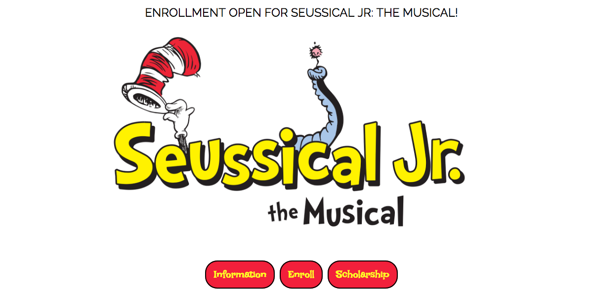

# VYP - Seussical, The Musical!

## About
This is a full-stack app that was built for Aurora, CO's Vintage Theatre, one of the largest non-profit live theatres in Colorado.

Vintage required a means of tracking the registry for their Youth Program's summer camp, which accepts both paid enrollees as well as scholarship students.

## Installation

This project was generated with [Angular CLI](https://github.com/angular/angular-cli) version 6.0.8. To get the Angular CLI, run `npm install -g @angular/cli`

Run `npm install` to install dependencies.

## Serving

Run `ng serve` for a dev client server. Navigate to `http://localhost:4200/`. The app will automatically reload if you change any of the source files.

## Tech Used
- Angular 6
- TypeScript
- Express
- Knex
- PostgreSQL
- Node.js
- Heroku
- Firebase

## API

- https://vypheroku.herokuapp.com/students
- https://vypheroku.herokuapp.com/scholarships

## Contact info
- cchooley@gmail.com
- https://www.linkedin.com/in/conor-hooley/